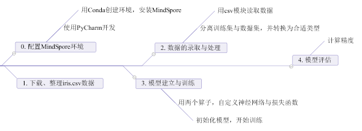

# 基于 MindSpore 的鸢尾花二分类实验

> 从原PDF档中节选搬运到这里。因为含有个人信息，恕不能公开原档。

## 第一部分 实验准备

### 1. 实验目标

1）掌握逻辑回归的基本概念。

2）掌握机器学习的一般流程。

3）掌握如何使用MindSpore进行逻辑回归实验。

4）掌握如何使用华为云ModelArts Notebook上传数据、执行Python代码。

### 2. 实验内容

取Iris数据集中的前两类数据（共100条），进行部分数据可视化，并将数据集分为训练集与测试集，使用`nn.Dense(4,1)`算子与`SigmoidCrossEntropyWithLogits()`算子进行建模并进行模型训练，最后对模型作评估

### 3. 实验流程图

## 第二部分 实验过程

略

## 第三部分 实验心得

### 1. 云服务器

在这次实验中，我经历了第一次使用云服务器，体验了华为云服务器进行人工智能运算，为后端开发积累了一定的实践经验，让我了解了云服务器的部分相关知识。

### 2. 人工智能模型

通过本次实验，我了解了人工智能模型构建的简单组成要素，了解了人工智能模型的一些概念和专业名词，并完成了一次简单的实践，收货颇丰；为后续人工智能学习奠定基础。

### 3. 环境配置

此前使用Python并没有接触过Conda环境。在这次实验中我们新建了一个环境来开发MindSpore，丰富了我对Python与Conda架构的认识；此外，在之前的开发中没有接触到Jupyter Notebook，在这次实验中也接触到了，并且了解到了其优点与特性。

### 4. Python经验积累

在这次开发中，更熟悉了部分Python功能的使用，对numpy模块运用得更熟练，对载入文件的熟练度提高。

### 5. 总结

感觉这次的实验比较艰辛，要查的东西太多，很考验我的自主学习能力，我认为是很新奇、很有趣的体验。
